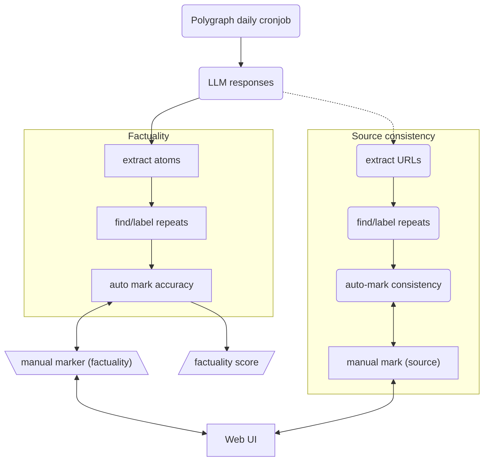

```mermaid
    graph TD
    %% Main Flow
    A(Polygraph daily cronjob ) --> B(LLM responses)
    B --> C1[extract atoms]

    subgraph factuality [Factuality]
        C1 --> C2[find/label repeats]
        C2 --> C3[auto mark accuracy]
    end
    

    B -.-> N1(extract URLs)
    %% Green Path (Annotated Flow)
    subgraph URL [Source consistency]
        
        N1 --> N2(find/label repeats)
        N2 --> N3(auto-mark consistency)
        N3 <--> N4@{ shape:lean-l, label: "manual mark (source)" }
    end
    
    %% Bottom Outputs
    C3 --> D1[/factuality score/]
    C3 <--> D2@{ shape: lean-l, label: "manual marker (factuality)" }
    D2 <--> D3[Web UI]
    N4 <--> D3

```
